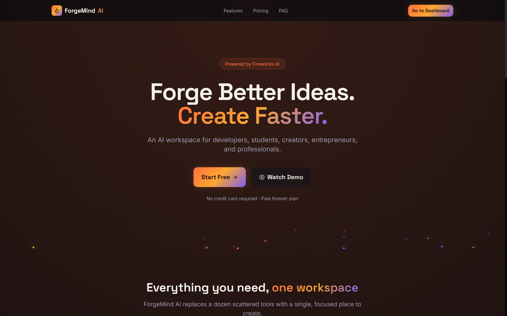
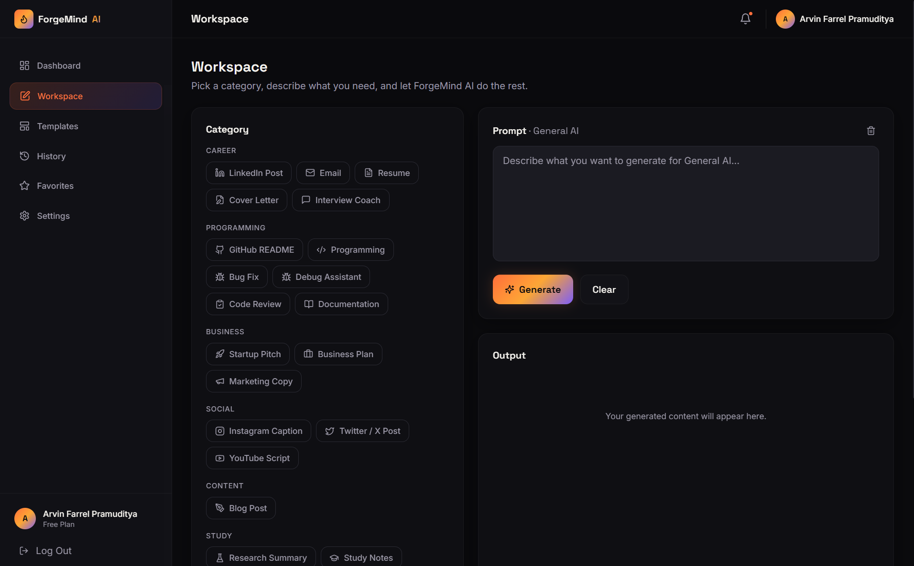
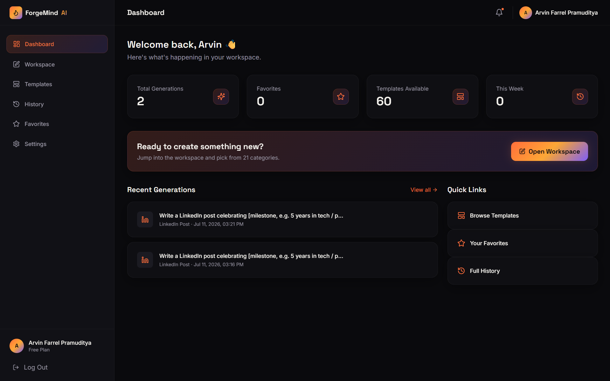

# ForgeMind AI

<p align="center">
  
</p>

<h1 align="center">ForgeMind AI</h1>

<p align="center">
  <strong>One Workspace. Unlimited AI Creativity.</strong>
</p>

<p align="center">
  A premium AI-powered workspace for software architecture, technical documentation, and developer productivity.
</p>

---

ForgeMind AI is a premium, production-ready SaaS-style AI workspace for developers, students, creators, entrepreneurs, and professionals. It runs entirely in the browser—**no backend required**—and connects directly to <a href="https://fireworks.ai">Fireworks AI</a> to generate high-quality content across 21 categories, from software architecture and technical documentation to code reviews, business plans, and blog articles.

---

## ✨ Features

- **AI Workspace** — a focused editor with category, tone, and language controls
- **21 Content Categories** — LinkedIn, GitHub README, Email, Resume, Cover Letter, Interview Coach, Programming, Bug Fix, Debug, Code Review, Documentation, Startup Pitch, Business Plan, Marketing Copy, Instagram, Twitter/X, YouTube Script, Blog, Research Summary, Study Notes, and General AI
- **60 Ready-to-Use Templates** — searchable and filterable by category
- **Markdown Output** — beautiful rendering with syntax-highlighted code blocks, word count, and estimated reading time
- **History & Favorites** — every generation is saved locally, searchable, and can be starred or deleted
- **Local Authentication** — register/login flow backed entirely by `localStorage` (no server)
- **Settings** — dark mode, accent color, animation toggle, and API key management
- **Resilient AI Service** — automatic retry with backoff, clear error handling, and a simulated streaming reveal
- **Fully Responsive** — desktop, tablet, and mobile layouts
- **Premium Dark UI** — glassmorphism, ember/molten gradients, and smooth Framer Motion transitions

## 🛠️ Tech Stack

| Layer               | Technology                                             |
| ------------------- | ------------------------------------------------------ |
| Framework           | React 19 + Vite                                        |
| Styling             | Tailwind CSS                                           |
| Animation           | Framer Motion                                          |
| Routing             | React Router v6                                        |
| State               | Zustand                                                |
| Forms               | React Hook Form                                        |
| Markdown            | react-markdown + remark-gfm                            |
| Syntax Highlighting | react-syntax-highlighter                               |
| Icons               | lucide-react                                           |
| AI Provider         | Fireworks AI (`accounts/fireworks/models/gpt-oss-20b`) |
| Deployment          | Vercel                                                 |

There is **no backend** — all AI calls are made directly from the browser to the Fireworks AI REST API, and all user data (accounts, history, favorites, settings) lives in `localStorage`.

## 🚀 Getting Started

### 1. Install dependencies

```bash
npm install
```

### 2. Configure your environment

Copy the example environment file and add your Fireworks AI API key:

```bash
cp .env.example .env
```

```env
VITE_FIREWORKS_API_KEY=your_fireworks_api_key_here
```

Get a free API key at [fireworks.ai](https://fireworks.ai). Alternatively, you can skip this step and paste your key directly into **Settings → Fireworks AI API Key** once the app is running — it's stored locally in your browser.

### 3. Run the dev server

```bash
npm run dev
```

The app will be available at `http://localhost:5173`.

### 4. Build for production

```bash
npm run build
npm run preview
```

## 🌐 Environment Variables

| Variable                 | Description                                                           | Required                                      |
| ------------------------ | --------------------------------------------------------------------- | --------------------------------------------- |
| `VITE_FIREWORKS_API_KEY` | Your Fireworks AI API key, used to call the chat completions endpoint | Optional if you set a key in Settings instead |

## ☁️ Deployment (Vercel)

1. Push this repository to GitHub.
2. Import the project into [Vercel](https://vercel.com/new).
3. Framework preset: **Vite**.
4. Build command: `npm run build` · Output directory: `dist`.
5. Add the `VITE_FIREWORKS_API_KEY` environment variable in the Vercel project settings (optional — users can also supply their own key in-app).
6. Deploy.

## 📁 Folder Structure

```
forgemind-ai/
├── public/
│   └── favicon.svg
├── src/
│   ├── assets/                # Static assets
│   ├── components/
│   │   ├── ui/                # Button, Card, Badge, Input, Modal, Dropdown, Toast, Spinner, Skeleton
│   │   ├── layout/             # Navbar, Sidebar, Footer, DashboardLayout, PublicLayout, ProtectedRoute, EmberField
│   │   ├── landing/             # Hero, Features, Pricing, FAQ, CTASection
│   │   └── workspace/           # CategorySelector, OutputPanel
│   ├── hooks/                  # useAIGenerate, useLocalStorage
│   ├── pages/                   # Landing, Login, Register, Dashboard, Workspace, Templates, History, Favorites, Settings, NotFound
│   ├── services/                 # aiService.js (Fireworks AI client)
│   ├── store/                    # authStore, settingsStore, historyStore, toastStore (Zustand)
│   ├── utils/                     # categories.js, templates.js, format.js
│   ├── App.jsx
│   ├── main.jsx
│   └── index.css
├── .env.example
├── index.html
├── package.json
├── postcss.config.js
├── tailwind.config.js
├── vite.config.js
└── README.md
```

## 📸 Screenshots

### Landing Page



### Workspace



### Dashboard



---

## 🔐 Data & Privacy

ForgeMind AI is designed with a privacy-first approach.

- No backend server is required.
- No user data is stored on external databases.
- Accounts, generation history, favorites, settings, and preferences are stored locally using the browser's Local Storage.
- AI requests are sent directly from the browser to the Fireworks AI API using the user's API key.
- No analytics or tracking services are included.

Your data remains under your control and never leaves your device except for AI inference requests made to Fireworks AI.

## 📄 License

MIT License — free to use, modify, and distribute.
